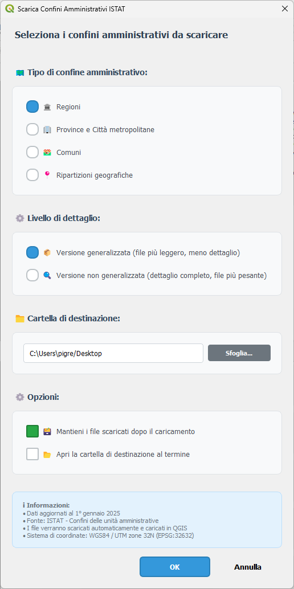

# Confini Amministrativi ISTAT

Plugin QGIS per scaricare e caricare automaticamente i confini amministrativi italiani da ISTAT.

## Descrizione

Questo plugin permette di scaricare direttamente i confini amministrativi italiani dal sito ISTAT e caricarli automaticamente in QGIS. Supporta regioni, province, comuni e ripartizioni geografiche sia in versione generalizzata che non generalizzata.

I dati sono aggiornati al 1° gennaio 2025 e vengono scaricati direttamente dai server ISTAT.

## Funzionalità principali

- 🔄 Download automatico dei file ZIP da ISTAT
- 🗺️ Selezione tra 4 tipi di confini amministrativi:
  - Regioni
  - Province  
  - Comuni
  - Ripartizioni geografiche
- ⚙️ Opzione per versione generalizzata o dettagliata
- 🎯 Caricamento automatico in QGIS
- 🇮🇹 Interfaccia completamente in italiano
- 📊 Barra di progresso durante il download
- ⚠️ Gestione errori integrata

## Requisiti

- **QGIS**: versione 3.0 o superiore
- **Connessione internet**: necessaria per il download dei dati

## Installazione

### Da Repository QGIS
1. Apri QGIS
2. Vai su `Plugin → Gestisci e installa plugin`
3. Cerca "Confini Amministrativi ISTAT"
4. Clicca su "Installa plugin"

### Installazione manuale
1. Scarica il plugin dal [repository GitHub](https://github.com/tuousername/istat-confini-plugin)
2. Estrai il file ZIP nella cartella dei plugin di QGIS
3. Riavvia QGIS
4. Attiva il plugin dal menu Plugin

## Utilizzo

1. **Avvia il plugin**: 
   - Toolbar: clicca sull'icona del plugin
   - Menu: `Plugin → Confini Amministrativi ISTAT`

2. **Seleziona il tipo di confine**:
   - Regioni
   - Province
   - Comuni  
   - Ripartizioni geografiche

3. **Scegli la versione**:
   - ☑️ Generalizzata (semplificata, file più piccoli)
   - ☐ Non generalizzata (dettagliata, precisione massima)

4. **Avvia il download**: 
   - Clicca su "Scarica e carica"
   - Attendi il completamento (monitorato dalla barra di progresso)

5. **Risultato**: 
   - Il layer viene automaticamente aggiunto alla mappa
   - I dati sono pronti per l'analisi

## Struttura dati

I confini scaricati includono:

### Attributi comuni
- **Codice ISTAT**: Identificativo ufficiale
- **Denominazione**: Nome dell'entità amministrativa
- **Geometria**: Poligoni in coordinate geografiche (EPSG:4326)

### Specifici per tipo
- **Regioni**: Codice regione, ripartizione geografica
- **Province**: Codice provincia, regione di appartenenza
- **Comuni**: Codice comune, provincia, regione, popolazione
- **Ripartizioni**: Nord-Ovest, Nord-Est, Centro, Sud, Isole

## Formati supportati

- **Input**: File ZIP da server ISTAT
- **Output**: Shapefile caricati direttamente in QGIS
- **Proiezione**: EPSG:32632

## Risoluzione problemi

### Errore di connessione
- Verifica la connessione internet
- Controlla proxy/firewall aziendali
- Riprova più tardi (server ISTAT temporaneamente non disponibile)

### File non trovato
- I link ISTAT potrebbero essere cambiati
- Segnala il problema tramite [GitHub Issues](https://github.com/tuousername/istat-confini-plugin/issues)

### Plugin non visibile
- Verifica che QGIS sia versione 3.0+
- Attiva il plugin da `Plugin → Gestisci e installa plugin`
- Riavvia QGIS se necessario

## Sviluppo

### Contributi
I contributi sono benvenuti! Per contribuire:

1. Fai fork del repository
2. Crea un branch per la tua feature
3. Implementa le modifiche
4. Testa con diverse versioni QGIS
5. Invia una Pull Request

### Test
- Testato su QGIS 3.16-3.40
- Compatibile Windows, Linux, macOS
- Testato con tutti i tipi di confini ISTAT

## Supporto

- 📧 **Email**: pigrecoinfinito@gmail.com
- 🐛 **Issues**: [GitHub Issues](https://github.com/tuousername/istat-confini-plugin/issues)  
- 📖 **Repository**: [GitHub](https://github.com/tuousername/istat-confini-plugin)

## Licenza

Questo plugin è rilasciato sotto licenza open source. Vedi il file LICENSE per i dettagli.

## Changelog

### v1.0.0 (2025)
- ✨ Prima release del plugin
- 🔄 Download automatico confini ISTAT 2025
- 🗺️ Supporto per tutti i livelli amministrativi italiani
- ⚙️ Opzione generalizzata/non generalizzata
- 🇮🇹 Interfaccia utente intuitiva in italiano
- 📊 Gestione errori e barra di progresso

## Ringraziamenti

- **ISTAT** per la disponibilità dei dati cartografici
- **Comunità QGIS** per il framework di sviluppo plugin
- **Contributori** del progetto
- **Claude AI** per aver creato gli script
