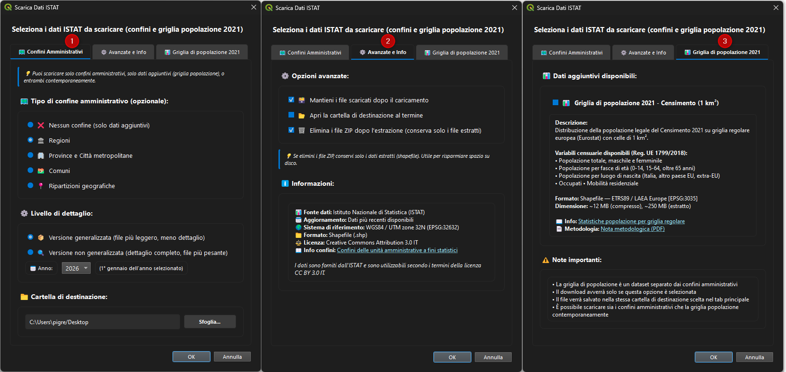

# Confini Amministrativi ISTAT

Plugin QGIS per scaricare e caricare automaticamente i confini amministrativi italiani da ISTAT e il grigliato popolazione 2021.

## Descrizione

Questo plugin permette di scaricare direttamente i confini amministrativi italiani dal sito ISTAT e caricarli automaticamente in QGIS. Supporta regioni, province, comuni e ripartizioni geografiche sia in versione generalizzata che non generalizzata.

I dati sono disponibili per gli anni 2022-2026 (selezionabili dall'interfaccia) e vengono scaricati direttamente dai server ISTAT.

## Funzionalità principali

- 🔄 Download automatico dei file ZIP da ISTAT
- 🗺️ Selezione tra 4 tipi di confini amministrativi:
  - Regioni
  - Province  
  - Comuni
  - Ripartizioni geografiche
- ⚙️ Opzione per versione generalizzata o dettagliata
- 📊 Griglia di popolazione ISTAT 2021 (Censimento su griglia europea 1 km²)
- 🎯 Caricamento automatico in QGIS
- 🇮🇹 Interfaccia completamente in italiano con 3 tab organizzati
- 📊 Barra di progresso durante il download
- 🔄 Download multipli simultanei (confini + griglia popolazione)
- ⚠️ Gestione errori integrata

## Requisiti

- **QGIS**: versione 3.16 o superiore (incluso QGIS 4.x)
- **Connessione internet**: necessaria per il download dei dati

## Installazione

### Da Repository QGIS
1. Apri QGIS
2. Vai su `Plugin → Gestisci e installa plugin`
3. Cerca "Confini Amministrativi ISTAT"
4. Clicca su "Installa plugin"

### Installazione manuale
1. Scarica il plugin dal [repository GitHub](https://github.com/pigreco/istat_confini_plugin)
2. Estrai il file ZIP nella cartella dei plugin di QGIS
3. Riavvia QGIS
4. Attiva il plugin dal menu Plugin

## Utilizzo

1. **Avvia il plugin**: 
   - Toolbar: clicca sull'icona del plugin
   - Menu: `Plugin → Confini Amministrativi ISTAT`

2. **🗺️ Tab Confini Amministrativi - Seleziona i dati da scaricare**:
   - **Confini amministrativi (opzionale)**:
     - Nessun confine (solo dati aggiuntivi)
     - Regioni
     - Province
     - Comuni
     - Ripartizioni geografiche
   - **Anno di riferimento**: seleziona l'anno dei dati (2022-2026, default 2026)
   - Scegli la versione (generalizzata o non generalizzata) se scarichi confini
   - Seleziona la cartella di destinazione

3. **⚙️ Tab Avanzate e Info**:
   - Configura opzioni avanzate:
     - Mantieni file scaricati dopo il caricamento
     - Apri cartella di destinazione al termine  
     - Elimina file ZIP dopo estrazione (risparmio spazio)
   - Visualizza informazioni sui dati ISTAT

4. **📊 Tab Griglia di popolazione 2021** ✨ **NOVITÀ**:
   - Seleziona per scaricare la **Griglia di Popolazione ISTAT 2021**
   - Distribuzione popolazione legale Censimento 2021 su griglia europea
   - Variabili censuarie secondo Regolamento UE 1799/2018
   - Griglia regolare con celle di 1 km² (~12 MB compressi, ~250 MB estratti)

5. **Avvia il download**: 
   - Clicca su "OK" per iniziare
   - Puoi scaricare: solo confini, solo griglia popolazione, o entrambi
   - Monitora il progresso con la barra di avanzamento

6. **Risultato**: 
   - I layer vengono automaticamente aggiunti alla mappa
   - I dati sono pronti per l'analisi

## Struttura dati

### Confini Amministrativi

I confini scaricati includono:

#### Attributi comuni
- **Codice ISTAT**: Identificativo ufficiale
- **Denominazione**: Nome dell'entità amministrativa
- **Geometria**: Poligoni in coordinate geografiche (EPSG:32632)

#### Specifici per tipo
- **Regioni**: Codice regione, ripartizione geografica
- **Province**: Codice provincia, regione di appartenenza
- **Comuni**: Codice comune, provincia, regione, popolazione
- **Ripartizioni**: Nord-Ovest, Nord-Est, Centro, Sud, Isole

### 📊 Griglia di Popolazione 2021 ✨ **NOVITÀ**

Dataset della distribuzione della popolazione legale relativa al Censimento 2021 su **griglia regolare europea** (Eurostat) con celle di 1 km²:

#### Variabili censuarie (Regolamento UE 1799/2018)
- **Popolazione totale**, maschile e femminile  
- **Popolazione per fasce di età**: 0-14 anni, 15-64 anni, oltre 65 anni
- **Popolazione per luogo di nascita**: 
  - Nati in Italia
  - Nati in altro paese EU  
  - Nati in altro paese extra-EU
- **Occupati**
- **Mobilità residenziale**:
  - Stessa dimora un anno prima
  - Altra dimora un anno prima in Italia
  - Altra dimora un anno prima all'estero

#### Caratteristiche della griglia
- ✅ **Celle uniformi**: tutte le celle hanno la stessa dimensione (1 km²)
- ✅ **Stabilità temporale**: griglia europea stabile nel tempo  
- ✅ **Integrazione facile**: i dati si integrano facilmente tra loro
- ✅ **Flessibilità**: aggregazione/suddivisione indipendente dai confini amministrativi
- ✅ **Comparabilità europea**: confronti standardizzati tra paesi europei

#### Specifiche tecniche
- **Sistema di riferimento**: ETRS89 / LAEA Europe [EPSG:3035]  
- **Risoluzione**: 1 km² per cella
- **Copertura**: intero territorio nazionale
- **Fonte**: Censimento permanente popolazione e abitazioni ISTAT 2021
- **Standard**: Griglia europea Eurostat (Reg. UE 1799/2018)
- **Dimensione**: ~12 MB (compresso), ~250 MB (estratto)
- **📖 Documentazione ufficiale**: [Statistiche sulla popolazione per griglia regolare](https://www.istat.it/notizia/statistiche-sulla-popolazione-per-griglia-regolare/)
- **📄 Nota metodologica**: [Metodologia elaborazione griglia (PDF)](https://www.istat.it/wp-content/uploads/2023/07/NotaMetodologicaGriglia2021-Ind.pdf)

## Formati supportati

- **Input**: File ZIP da server ISTAT
- **Output**: Shapefile caricati direttamente in QGIS
- **Proiezioni**: 
  - Confini amministrativi: EPSG:32632 (WGS 84 / UTM zone 32N)
  - Griglia popolazione: EPSG:3035 (ETRS89 / LAEA Europe)

## Integrazione dati

La griglia di popolazione può essere facilmente integrata con i confini amministrativi per analisi avanzate:
- **Analisi demografiche territoriali**: sovrapposizione griglia-confini per statistiche per comune/provincia
- **Pianificazione territoriale**: identificazione aree ad alta/bassa densità
- **Studi di mobilità**: analisi spostamenti residenziali
- **Confronti europei**: utilizzo standard Eurostat per comparazioni internazionali

## Risoluzione problemi

### Errore di connessione
- Verifica la connessione internet
- Controlla proxy/firewall aziendali
- Riprova più tardi (server ISTAT temporaneamente non disponibile)

### Errore certificati SSL
- Il plugin usa verifica SSL completa per default (sicurezza)
- I server ISTAT hanno spesso certificati problematici
- Se si verifica errore SSL, il plugin offre di riprovare senza verifica SSL
- La disabilitazione SSL è temporanea e solo per i server ISTAT

### File non trovato
- I link ISTAT potrebbero essere cambiati
- Segnala il problema tramite [GitHub Issues](https://github.com/pigreco/istat_confini_plugin/issues)

### Plugin non visibile
- Verifica che QGIS sia versione 3.0+
- Attiva il plugin da `Plugin → Gestisci e installa plugin`
- Riavvia QGIS se necessario

## Sviluppo

### Contributi
I contributi sono benvenuti! Per contribuire:

1. Fai fork del repository
2. Crea un branch per la tua feature
3. Implementa le modifiche
4. Testa con diverse versioni QGIS
5. Invia una Pull Request

### Test
- Testato su QGIS 3.16-3.40 e QGIS 4.x
- Compatibile Windows, Linux, macOS
- Testato con tutti i tipi di confini ISTAT

## Supporto

- 📧 **Email**: pigrecoinfinito@gmail.com
- 🐛 **Issues**: [GitHub Issues](https://github.com/pigreco/istat_confini_plugin/issues)  
- 📖 **Repository**: [GitHub](https://github.com/pigreco/istat_confini_plugin)

## Licenza

Questo plugin è rilasciato sotto licenza open source. Vedi il file LICENSE per i dettagli.

## Changelog

### v1.3.0 (2026)
- 📅 **NUOVO**: Selezione anno di riferimento 2022-2026 (default 2026)
- 🔗 URL di download parametrizzate per anno (dati al 1° gennaio dell'anno scelto)
- 🎨 Interfaccia tema scuro: stylesheet con `palette()` Qt per compatibilità QGIS 4 / Win11
- 🔧 Fix download bloccato su QGIS 4.x: `QgsBlockingNetworkRequest` al posto di `QEventLoop+QThread`
- 🔧 Fix Qt6: segnale `QNetworkReply.errorOccurred` (rinominato da `error`)

### v1.2.0 (2025)
- ⚙️ Porting QGIS 4.x / Qt6 / PyQt6
- `exec_()` → `exec()`, enum Qt qualificati, costanti try/except per retrocompatibilità QGIS 3.16+
- `qgisMinimumVersion=3.16`, `qgisMaximumVersion=4.99`, `supportsQt6=True`

### v1.1.0 (2025)
- 📊 **NUOVO**: Tab "Griglia di popolazione 2021" per dataset demografici ISTAT
- 🔄 **NUOVO**: Download multipli simultanei (confini + griglia popolazione)
- ❌ **NUOVO**: Opzione "Nessun confine" per scaricare solo griglia popolazione
- 🗑️ **NUOVO**: Opzione "Elimina file ZIP" per risparmiare spazio su disco
- 📈 **NUOVO**: Griglia popolazione Censimento 2021 su standard europeo (Eurostat)
- 🇪🇺 **NUOVO**: 13 variabili censuarie secondo Regolamento UE 1799/2018
- 🎯 Interfaccia migliorata con 3 tab organizzati e UI dinamica
- ⚡ Sistema di download in coda ottimizzato
- 🛡️ Gestione errori migliorata per download multipli
- 📋 Messaggi di successo più informativi

### v1.0.0 (2025)
- ✨ Prima release del plugin
- 🔄 Download automatico confini ISTAT
- 🗺️ Supporto per tutti i livelli amministrativi italiani
- ⚙️ Opzione generalizzata/non generalizzata
- 🇮🇹 Interfaccia utente intuitiva in italiano
- 📊 Gestione errori e barra di progresso

## Ringraziamenti

- **ISTAT** per la disponibilità dei dati cartografici
- **Comunità QGIS** per il framework di sviluppo plugin
- **Contributori** del progetto
- **Claude AI** per aver creato gli script
